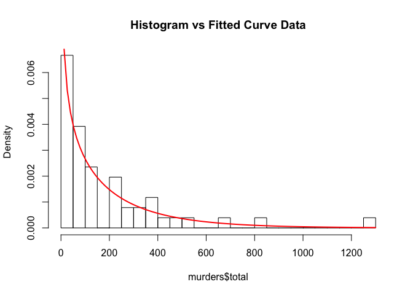

Probability Model Selection using R
================
Christopher Martinez Servin
8/9/2018

This is a simplified guide for selecting and fitting a probability model to a dataset. For detailed information, a good start point is the [Wiki page](https://en.wikipedia.org/wiki/Probability_theory) for *probability theory*.

### Generic Steps

<https://cran.r-project.org/>

1.  Compute the moments (mean, std. dev., etc.) from data
2.  Propose a model based on judgment, past experience, and physical constraints
3.  Calibrate the proposed model and fit distribution parameters using techniques such as **Method of Moments**, **Method of Maximum Likelihood**, **Graphical technique 'Probability Plot'**, etc.
4.  Make *Qualitatively and Quantitative* comparisons
    1.  Normalized Sample Histogram vs. Fitted PDF
    2.  Sample Empirical CDF vs. Fitted CDF
    3.  Statistical goodness-of-fit tests such as **R*<sup>2</sup> for regression*, **χ*<sup>2</sup>-test*, *K-S test*, etc.

### Exercise One

Let's start by creating our own dataset and using the **fitdistr** function from the **MASS** package to fit the distribution

First we create 250 observations of sample data from a Weibull Distribution

``` r
library(MASS)
set.seed(100)
weibull_data <- rweibull(250, shape = 2, scale = 5)
```

Next we visualize the data

``` r
hist(weibull_data, breaks = 25, main = "Histogram of Weibull Data")
```

 Per the generic steps described above, we can propose a model based on judgment. In this case we know the data can fit a weibull distribution

``` r
fit_weibull = fitdistr(weibull_data, densfun = "weibull")
fit_weibull
```

    ##      shape       scale  
    ##   2.0771423   4.9178426 
    ##  (0.1027845) (0.1577411)

We know that the parameters used to generate the random data were shape = 2, scale = 5. From the results above, the **fitdistr** function is telling us that the shape is 2.07 and the scale is 4.9. Close enough. Note that **fitdistr** is using the *Method of Maximum Likelihood* to estimate the distribution parameters. To learn more, visit the documentation website -&gt; <https://stat.ethz.ch/R-manual/R-devel/library/MASS/html/fitdistr.html>

We can then plot the histogram for the sample data to the fitted probability density function

``` r
hist(weibull_data, breaks = 25, probability = TRUE, main = "Histogram vs Fitted Curve Weibull Data")
curve(dweibull(x, fit_weibull$estimate[1], fit_weibull$estimate[2]), col="red", lwd=2, add = T)
```


### Exercise Two

Great, that was a good example. But what if we have no idea of what distribution fits the data? Let's explore the use of a different library: **fitdistrplus**

``` r
library(fitdistrplus)
```

    ## Loading required package: survival

**fitdistrplus** is another method in R for fitting distributions. For this exercise, lets use the data set *Murders* from the package *dslabs*. This package is put together by [*Rafael Irizarry*](http://rafalab.github.io) from *Harvard University* for the edX online [*HarvardX Data Science program*](https://www.edx.org/professional-certificate/harvardx-data-science)

``` r
library(dslabs)
data("murders")
```

This data set contains murder data in the United States of America.

Let's do some data exploration

``` r
str(murders)
```

    ## 'data.frame':    51 obs. of  5 variables:
    ##  $ state     : chr  "Alabama" "Alaska" "Arizona" "Arkansas" ...
    ##  $ abb       : chr  "AL" "AK" "AZ" "AR" ...
    ##  $ region    : Factor w/ 4 levels "Northeast","South",..: 2 4 4 2 4 4 1 2 2 2 ...
    ##  $ population: num  4779736 710231 6392017 2915918 37253956 ...
    ##  $ total     : num  135 19 232 93 1257 ...

``` r
head(murders)
```

    ##        state abb region population total
    ## 1    Alabama  AL  South    4779736   135
    ## 2     Alaska  AK   West     710231    19
    ## 3    Arizona  AZ   West    6392017   232
    ## 4   Arkansas  AR  South    2915918    93
    ## 5 California  CA   West   37253956  1257
    ## 6   Colorado  CO   West    5029196    65

We will work with the total number of murders per U.S. state and try to fit a distribution for this data. Let's visualize it.

``` r
hist(murders$total,breaks = 20, main = "Histogram of total murders in the U.S. per State")
```

 Instead of creating a histogram, we could also plot the empirical probability density and cumulative distribution.

``` r
plotdist(murders$total, histo = TRUE, demp = TRUE)
```

 Another tool is to show descriptive statistics, like the moments, to help us in making a decision

``` r
descdist(murders$total, discrete = FALSE, boot = 100)
```


    ## summary statistics
    ## ------
    ## min:  2   max:  1257 
    ## median:  97 
    ## mean:  184.3725 
    ## estimated sd:  236.1261 
    ## estimated skewness:  2.507494 
    ## estimated kurtosis:  11.1794

Now, before we continue with the interpretation of the results let's make something clear: Real data doesn't necessarily follow any particular distribution. **Parametric distributions are not a perfect description of reality.**

With that being said, the above results are telling us that the skewness and kurtosis are consistent with gamma, exponential, and lognorm distributions. The plot also includes a nonparametric bootstrap procedure for the values of kurtosis and skewness.

#### Fitting a distribution

From the plot above, we choose lognorm, exponential and gamma distributions to fit the data using **fitdist** from **fitdistrplus**.

``` r
exponential_fit = fitdist(murders$total, "exp")
gamma_fit = fitdist(murders$total, "gamma")
lognormal_fit = fitdist(murders$total, "lnorm")
```

And then we can plot the results

``` r
plot.legend <- c("Exponential", "Gamma", "Lognormal")
denscomp(list(exponential_fit, gamma_fit, lognormal_fit), legendtext = plot.legend)
```


``` r
cdfcomp (list(exponential_fit, gamma_fit, lognormal_fit), legendtext = plot.legend)
```


``` r
qqcomp  (list(exponential_fit, gamma_fit, lognormal_fit), legendtext = plot.legend)
```


``` r
ppcomp  (list(exponential_fit, gamma_fit, lognormal_fit), legendtext = plot.legend)
```

 We know that trying to obtain a solution from a visualization can be subjective, so we use some goodness-of-fit quantitative methods.

``` r
gofstat(list(exponential_fit, gamma_fit, lognormal_fit), fitnames = c("Exponential", "Gamma", "LogNorm"))
```

    ## Goodness-of-fit statistics
    ##                              Exponential      Gamma   LogNorm
    ## Kolmogorov-Smirnov statistic   0.1470814 0.07555767 0.1173972
    ## Cramer-von Mises statistic     0.2846769 0.04689658 0.1170886
    ## Anderson-Darling statistic     1.9855232 0.30833778 0.6811503
    ## 
    ## Goodness-of-fit criteria
    ##                                Exponential    Gamma  LogNorm
    ## Akaike's Information Criterion    636.1298 632.9223 635.3197
    ## Bayesian Information Criterion    638.0616 636.7860 639.1833

From all the above statistics, including K-S test, AIC, BIC, etc, we see that the Gamma function is the best fit for the data. Let's get the parameters of the distribution and plot them against the data.

``` r
gamma_fit
```

    ## Fitting of the distribution ' gamma ' by maximum likelihood 
    ## Parameters:
    ##          estimate   Std. Error
    ## shape 0.694146462 0.1112233589
    ## rate  0.003765181 0.0007858917

``` r
hist(murders$total, breaks = 20, probability = TRUE, main = "Histogram vs Fitted Curve Data")
curve(dgamma(x, shape = gamma_fit$estimate[1], rate = gamma_fit$estimate[2]), col="red", lwd=2, add = T)
```

 Great! we were able to fit a distribution and obtain the paremeters in order to solve any further questions.
